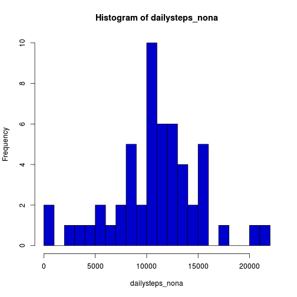
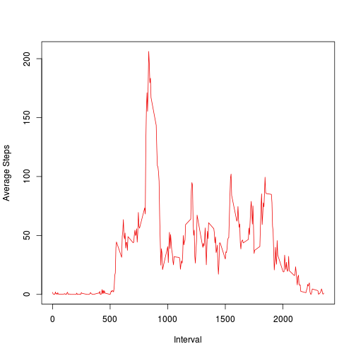
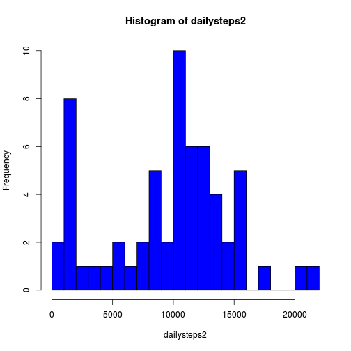
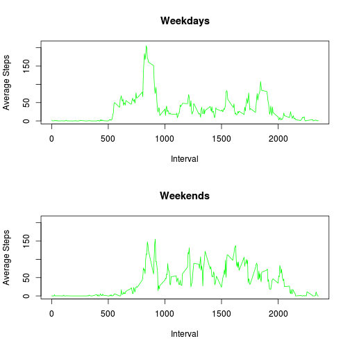

## Loading and preprocessing the data

First we unzip, load and transform the data:
* Steps are numbers
* dates are factors
* intervals are also factors, but converted to numeric first for sorting purposes

```r
unzip("activity.zip")
data <- read.csv("activity.csv",colClasses="character",na.strings = "NA")
data <- transform(data,date=factor(date),steps=as.numeric(steps),interval=factor(as.numeric(interval)))
data_nona <- data[!is.na(data$steps),]
```

## What is mean total number of steps taken per day?

Add steps for each day, stripping NAs.

```r
dailysteps <- tapply(data_nona$steps,data_nona$date,sum)
dailysteps_nona <- dailysteps[!is.na(dailysteps)]
```
A histogram of these values:

```r
hist(dailysteps_nona,col="blue3",breaks=20)
```

 

The mean of the daily totals:

```r
mean(dailysteps_nona)
```

```
## [1] 10766.19
```
The median of the daily totals:

```r
median(dailysteps_nona)
```

```
## [1] 10765
```

## What is the average daily activity pattern?

Take the mean of the steps for a given 5 minute interval:

```r
intervalmean <- tapply(data_nona$steps,data_nona$interval,mean)
```
Plot time of day against number of steps:

```r
plot(names(intervalmean),intervalmean,type="l",col="red2",xlab="Interval", ylab="Average Steps")
```

 

Interval containing the maximum mean number of steps, along with that mean reading:

```r
mmeanInt <- names(which.max(intervalmean))
paste(mmeanInt,":",intervalmean[[mmeanInt]])
```

```
## [1] "835 : 206.169811320755"
```

## Imputing missing values

I've decided to replace missing values for a given interval with the median
for that interval.


```r
intervalmedian <- tapply(data$steps,data$interval,median,na.rm=T)
steps2 <- mapply(function(a,b) if (!is.na(a)) { a } else { intervalmedian[[b]] },data$steps, data$interval)
data2 <- data.frame(steps=steps2,date=data$date,interval=data$interval)
```
New daily step total histogram:

```r
dailysteps2 <- tapply(data2$steps,data2$date,sum)
hist(dailysteps2,col="blue1",breaks=20)
```

 
The new mean is:

```r
mean(dailysteps2)
```

```
## [1] 9503.869
```
The new median:

```r
median(dailysteps2)
```

```
## [1] 10395
```

## Are there differences in activity patterns between weekdays and weekends?

Add a "weekday" column to my new frame with filled in data:

```r
data2[["weekday"]] <- factor(sapply(weekdays(as.Date(data$date)), function(x) if (x=="Saturday"|x=="Sunday") {"weekend"} else {"weekday"}))
```
Create mean arrays for the weekend and weekday subsets:

```r
we <- subset(data2,weekday=="weekend")
wd <- subset(data2,weekday=="weekday")
intervalmeanwe <- tapply(we$steps,we$interval,mean,na.rm=T)
intervalmeanwd <- tapply(wd$steps,wd$interval,mean,na.rm=T)
```
Plots:

```r
par(mfrow=c(2,1))
plot(names(intervalmeanwd),intervalmeanwd,type="l",col="green",main= "Weekdays", xlab="Interval", ylab="Average Steps", ylim=c(0,210))
plot(names(intervalmeanwe),intervalmeanwe,type="l",col="green",main= "Weekends", xlab="Interval", ylab="Average Steps", ylim=c(0,210))
```

 
